# rabadon

[](https://github.com/nosey-dewdrop/rabadon/actions/workflows/ci.yml)

rabadon catches your coding agent's error before it compounds, and fixes it. It runs inside the live session, not over the logs afterwards. It sees the error in the move that makes it, while the move is still a proposal. And it hands the agent the one thing the agent cannot see for itself — what actually broke, and where this attempt diverges from the last one that worked — so the agent writes the fix. Not a watchdog, not a gate, not a dashboard: stopping is not the product, getting unstuck is.



<sub>Thirty-four seconds, nine commands, no narration. Every line is captured stdout and stderr from a process that ran, the two rules that fire were written after real incidents in this repository, and the exit codes and millisecond counts are the measured ones. `./scripts/record-cast.sh` re-records it end to end; the frames are in [`docs/cast/frames.jsonl`](docs/cast/frames.jsonl) if you would rather read them than watch.</sub>

A hook is advice. rabadon is the layer that also makes the advice **hold**: the deterministic gate refuses the force-push before it rewrites history, stops the loop on its third identical spin, refuses the assertion-strip while the suite is red, holds the untested push. Eleven laws are compiled in and hold from the first minute, in a repo with no configuration at all — among them a force-push to a shared branch, a recursive delete resolving outside the project tree, a hard reset onto a shared branch, and a reach into rabadon's own switch or ledger. Your `guard.json` extends that floor and can switch any of the eleven off by id; none of them is sealed. (The three sealed ids are `promise-tamper`, `promise-anti-path` and `guard-weaken`, and they are not baseline laws.) When you ask for it, the same rules compile into a kernel sandbox, so a forbidden write fails with `EPERM` even if the gate was bypassed. Every event is chained by SHA-256 to the one before it, so the ledger you show people can be verified, not just trusted.

Everything is local, by law: events append to `~/.rabadon/spool/` on your machine with `write(2)` under an exclusive lock, and are mirrored to a unix socket for the live cockpit when one is listening. No account, no upload, nothing leaves.

**Your agent, not just mine.** `rabadon init` wires Claude Code *and* Cursor, and any other agent supervises itself through a documented contract — pipe one small JSON object to `rabadon-gate`, read exit 2 as a refusal, with no change to rabadon at all. The laws never depended on an editor; only the binding did, and it now lives in one file ([`native/hookev.h`](native/hookev.h)). Where an agent can do less, that is written down rather than glossed: Cursor has no *before*-file-edit hook, so on Cursor an agent's edit is recorded after it lands while shell writes are still refused before they run. Full table and the contract: [docs/agent-contract.md](docs/agent-contract.md).

## Install

Not on npm yet — install from source. (The package is built and the release
workflow is wired; publishing is its own step, and until it happens this page
will not print a command that cannot work.)

```sh
git clone https://github.com/nosey-dewdrop/rabadon && cd rabadon
npm install && npm link   # builds the native core with clang++/g++, puts `rabadon` on your PATH

cd your-project
rabadon init              # authors guard rules from your law files (CLAUDE.md / RULES.md),
                          # or writes a safe baseline; merges hooks into your existing
                          # .claude/settings.json (backed up, never clobbered)
rabadon drill             # see a real refusal in 30 seconds, without waiting for an incident
claude                    # work normally — the session is supervised
rabadon usage             # the ledger: what was caught, backed by timestamped events
```

macOS + Linux, Node ≥ 18. The core is ~20k lines of dependency-free C++; prebuilt binaries ship per platform, and if none matches, the postinstall builds from source with `clang++`/`g++` (`rabadon doctor` diagnoses either way). Full walkthrough: [docs/quickstart.md](docs/quickstart.md).

## A real catch, verbatim

From the author's own week, replayable from the spool — a mid-session `wrangler deploy` refused by a project's own deny rule:

```
{"ts":1785072099372,"pipe":"stitchu:session","ev":"CHECK_FAIL","step":"Bash",
 "fails":[{"check":"no-wrangler-deploy","why":"command matched deny rule: cd backend && npx wrangler deploy —
  ENV.md Deploy: wrangler deploy is the human's step; the agent must never deploy or claim the worker is live."}]}
```

`rabadon usage` turns a month of those into the only sales artifact that matters — what it caught, in your repo, on your work. Real output, captured 2026-08-20 by `RABADON_NOTIFY=0 rabadon usage --days 30`. Every count below is verbatim from the ledger. Three things were cut to fit, and cutting them silently would be the exact dishonesty this tool exists to refuse, so: it is trimmed to two of the ledger's projects; each project's rule list is trimmed to its top rules, so the rules shown add to less than the `caught before happening` total above them (stitchu: 152 of 171, the remaining 19 spread over eight more rules); and the `would have caught (watch)` breakdowns are dropped, though their total is still counted in the top line. The one-line reason beside each rule is written for this page — the real output prints the offending command instead. Run it yourself and you get the untrimmed thing:

```
rabadon usage — last 30 day(s) · local, nothing leaves this machine
source: /Users/damummyphus/.rabadon/spool

  520 refused before they happened · 90,274 actions gated · 2 repairs held · 3 unverified · 684 would-have-refused (watch)

  stitchu                                            last event: 2026-08-20 20:23
    actions gated:           20,332
    caught before happening:   171
       92x  ctest-tail-hides-verdict   piping the suite through tail buries the real verdict
       28x  push-gate                  code was edited after the last passing test run
       12x  no-ctest-list-as-green     listing the tests is not running them
       10x  no-rm-rf-outside-project   recursive delete outside the project tree is unrecoverable
        6x  no-wrangler-deploy         deploys go through CI, never from a live session
        2x  test-tamper                assertions removed from test_style.cpp while the suite is red
        2x  loop-stop                  the same command again with no code change in between
    checks failed (caught):    422   (loops stopped: 2)
    repairs held (locked):       0
    repairs unverified:          3
    push gates passed:          13
    rules written:               1

  express                                            last event: 2026-08-20 04:55
    actions gated:               80
    caught before happening:      2
    checks failed (caught):      21
    repairs held (locked):        2
    repairs unverified:           0

  (4,341 event(s) from rabadon's own drills/demos/self-tests — excluded from every number above)
```

The drill exclusion is load-bearing: a tool that counts its own self-tests as catches is worthless, so rabadon tags them at emit and never counts them. That honesty is the brand, and a claim like this is only worth the loosest surface that reads the ledger — so all three readers run the identical predicate, from one file. `rabadon export --otlp`, because it leaves the machine: the refusals in your Jaeger are the refusals in your terminal, to the event. `rabadon trace`, because it is the prettiest one and the one that ends up in a screenshot: a self-run renders `CAUGHT 0` under the banner `rabadon's own drill — excluded from every number`, and prints no saved-money line. Its own cost stays on screen, because excluded from every count is not the same as erased from the record.

So is the second line. `repairs held` and `repairs unverified` used to be one number called "repairs accepted", and that number also swept in green push-gate suites and freshly written rules — four different events sharing one name in the ledger. Split apart, the honest reading of this machine is that the repair path has produced **two** fixes proven against hash-locked test files — both on expressjs/express @ a3714473, its own mocha suite as the arbiter, 91 test files locked — and three that nothing was holding. A fix nobody could witness is not a fix rabadon gets to count.

And the two carry one more qualification, which travels with the number everywhere it is printed: both were on **planned** breakage — bugs planted to drive the loop end to end. On **unplanned** breakage — a bug nobody staged — the count is **0**. That is the number that will decide whether the repair path is real, and this page will keep printing it either way.

## The built-in laws

On every session, no configuration:

- **loop-stop** — the same command run 3× with no code change in between is a loop, not progress; refused.
- **test-tamper** — while the suite is red, an edit that weakens a test (skip added, assertions removed) is refused. Fix the code, not the thermometer.
- **push gate** — if your laws demand green tests before a push, rabadon runs the suite itself at push time and decides on the real result, never on a claim.
- **scope fan-out** — a task spreading across a 5th top-level directory is challenged once.

Plus your own laws, authored into `.rabadon/guard.json` (deny rules, protected paths, budgets) — see [docs/guard.md](docs/guard.md). Escape hatches are first-class: `rabadon off` pauses everything, and every refusal names its rule id so you can disable exactly that one (`"disabled": ["rule-id"]`).

## What it costs to run

**By default, nothing calls a model.** Every law above is deterministic C++: pattern matching, path resolution, exit codes, hashes. The gate adds ~3.1 ms to a tool call and, when it refuses, a short sentence to the agent's context — measured across this machine's entire ledger, 2,789 refusal texts totalling 410,342 characters, a median of 68 each. Roughly 5k tokens a day.

That was not always true, and it is worth saying plainly, because a supervision tool doing this quietly is the thing it exists to prevent. Until this release, installing rabadon signed you up for two `claude -p` calls on your own account from inside a hook: a drift judge every 12th action, and an incident diagnosis the moment your suite went red — up to 30 and 90 seconds of wall clock with your agent stopped dead, waiting, and a second bill beside the one you were already paying. Nothing announced either.

Both are opt-in now, and nothing that *refuses* got weaker: a red suite still ends the turn, and goal drift still gets a verdict from `rabadon-drift`, which measures against your `promise.json` and asks no model anything.

| variable | default | what it buys |
|---|---|---|
| `RABADON_JUDGE=1` | off | the drift judge + the red-suite diagnosis, for this shell |
| `"judge": true` in `.rabadon/guard.json` | off | the same, for this project, every session |
| `RABADON_JUDGE_MODEL` | `claude-haiku-4-5` | which model gives the drift verdict |
| `RABADON_DIAGNOSE_MODEL` | your account default | which model diagnoses a red suite |
| `RABADON_JUDGE=0` | — | off, and it wins over the guard key |

When a model *is* called, the ledger records it: `LLM_CALL` carrying the purpose, the model, and the milliseconds your session waited — including calls that came back empty, because the spend most worth seeing is the one that bought nothing. No USD on that line: `claude -p` reports no usage, so the number is not knowable there, and inventing one is exactly the sort of claim this project refuses. Cost comes from the transcripts, in `rabadon lens`, where it is measured — and lens prices what it recognises and *names* what it does not, so a new model family reads as `(no rate for: <name>)` with the token counts still exact.

## What makes it more than a hook

**Kernel enforcement — `rabadon exec`.** `exec` is a strict superset of the hook: it applies every rule the hook applies — your `guard.json` deny rules and the three laws compiled into the binary — and refuses with exit 2 before anything runs, writing the refusal into the same hash-chained ledger. On top of that, protected paths and network denies compile into an OS sandbox (macOS Seatbelt, Linux bubblewrap), so a forbidden write is refused by the kernel with `EPERM` even when nothing consulted rabadon first — a subprocess, an MCP tool, a shell one-liner that dodged the matcher. A shell wrapper is unwrapped before judging, so `exec -- sh -c "..."` is judged as the command it actually runs. If a fence is asked for and no backend can actually start, `exec` refuses to run rather than run unprotected — and it distinguishes "not installed" from "installed but the kernel will not let it start" (Ubuntu 24.04+ restricts unprivileged user namespaces by default, which stops `bwrap` dead; `rabadon doctor` names the sysctl). This is the hard boundary a hook alone cannot draw. Scope and bypass vectors are stated plainly in [docs/threat-model.md](docs/threat-model.md).

**Tamper-evident ledger — `rabadon audit`.** Every spool event carries `prev` = the SHA-256 of the line before it, and a `.head` sidecar written under the same lock commits two facts about the day: the last hash **and how many chained lines the file must have**. `rabadon audit` re-walks the chain and names any broken link by file and line. Edit, drop, reorder or truncate an event → break. Strip every `prev` → break (a stripped chain is not an unverified one). Delete a line and re-stitch the chain around the hole → the committed count convicts it. Delete the day file whole → its orphan sidecar convicts it. Exit 0 only when every file verified against its sidecar; exit 2 when a file cannot be verified at all, so "I don't know" never reads as "clean". **What it does not do:** anyone who can write both the day file and its sidecar can rewrite a day wholesale — the chain makes tampering evident, not impossible, and there is no external anchor ([threat model](docs/threat-model.md)). `rabadon replay` renders the verified timeline.

**Real repair — `rabadon repair`.** When a deterministic check goes red, `claude -p` proposes a fix **in an isolated copy** of the repo; the same check re-runs; a fix that turns it green *and* leaves every hash-locked test file untouched produces a **held patch** (`.rabadon/repair-<ts>.patch`) — reviewed and applied by you, never silently. A fix that games the check (weakens a test) is rejected. The arbiter is the project's own test suite, not an LLM judging itself — the un-gameable kernel.

**Speaks OpenTelemetry — `rabadon export`.** `rabadon export --otlp` emits the ledger as OTLP/JSON traces (one trace per session, one row per tool call, refusals as ERROR spans, GenAI-semconv `gen_ai.usage.*` / `gen_ai.request.model`, and the run's cost) so any backend — Jaeger, Grafana Tempo, Langfuse — renders a rabadon session. A tool call is two events at two instants, and the gate writes the `tool_use_id` both of its hooks are handed on both of them: the closing event spans the interval between them, the opening one nests inside it, and neither is dropped to buy the row. 395 of the first 396 calls carrying that id joined, and every joined span names the ledger line its start was read off, so the join is checkable against the bytes rather than trusted. Observation is a solved, standardized problem; rabadon exports to the standard instead of reinventing a dashboard. The token attributes are read under the keys the shipped binaries write, and the test that proves it builds its fixture by running those binaries — a claim about a producer that a hand-typed fixture checks is a claim about the test.

## Where it sits

| Tool | Can observe? | Can **stop** a bad action? | Can **repair** it? | Can **prove** the record? | Kernel enforcement? |
|---|---|---|---|---|---|
| Langfuse / Braintrust | yes | no — passive by design | no | no | no |
| Guardrails AI / Instructor | — | one structured output | re-ask, single output | no | no |
| **rabadon** | **yes (OTLP export)** | **yes — inline, pre-spend, fail-closed** | **yes — re-verified, held, un-gameable** | **yes — hash-chained audit** | **yes — Seatbelt / bwrap** |

Observation is table stakes. What nobody else in this class does: supervise a live coding-agent session, hold the enforcement down to the kernel, close the repair loop with the project's own tests as the arbiter, and hand you a ledger you can verify.

## The engine underneath

The session guard is one binding of a smaller thing: a runtime that runs work in bounded, checked, repairable steps. The JavaScript API (`pipeline()`, `session().wrap()`) is documented in [SPEC.md](SPEC.md); any runtime that can execute a subprocess can implement the same gate contract.

## Commands

`init` · `on`/`off`/`status` · `budget` · `lens` (`cost`) · `usage` (`stats`) · `report` · `trace` · `drift` · `drill` · `audit` · `replay` · `exec` · `do` · `loop` · `repair` · `verify` · `net` · `truth` · `export` · `lint` · `doctor` · `remove` · `watch` · `serve`. Full reference: [docs/commands.md](docs/commands.md). How the hooks, spool and modes fit together: [docs/how-it-works.md](docs/how-it-works.md).

`rabadon lens` is the cost half: sessions, tokens and USD read straight off the transcripts Claude Code already writes to disk — no wrapper, no key, and no model call to produce any number.

Every native binary answers `--help` and `-h` with its own screen — what it does, its arguments, and a runnable example — and refuses a flag it does not know rather than swallowing it. That refusal is not only about flags. `rabadon trace <run>` is the form the help screen teaches, and the word used to be taken as a file path: the path did not exist, so the renderer fell back to the newest day file and answered with the whole day's ledger at exit 0, and the run that was asked for was in yesterday's file, not among them. A word that names nothing now ends the run and says which word, and asking for a run that is not in the window exits non-zero with an empty stdout instead of a quiet `(no matching run)` at exit 0. `native/cli_test.sh` discovers the binaries by glob and holds every one of them to that, **and to being reachable**: an install puts exactly one file on your PATH, so a shipped binary the dispatcher never names is a binary nobody can run. The verb list in that test is parsed out of the dispatcher itself, never typed in.

## Prove it yourself

```sh
make && make test    # the native core: 20 suites, incl. kernel-EPERM, chain-tamper,
                     # and the caught→propose→re-verify repair loop, all green
npm test             # the JS surface: install/merge, wrap, store, ui
```

## Status

Building in public. **Proven, by running code committed here:** the session gate (deny rules, loop-stop, test-tamper, push gate) through the real binary; kernel-enforced protected paths (real OS `EPERM`), proven in CI on **both** backends — macOS Seatbelt and Linux bubblewrap; the hash-chained ledger with tamper detection; the session repair loop (caught → proposed in isolation → re-verified → held patch, fake fixes rejected); OTLP export; clean `init`/`remove`/`doctor`. **[building]:** the local dashboard (`rabadon ui`) is a stub — `rabadon watch` is the live surface today. **Honest gap:** the repair loop is proven on scripted repos and on a foreign one — two repairs held on expressjs/express on 2026-08-01, judged by that project's own suite, both on **planted** breakage. On unplanned breakage — a bug nobody staged — the count is **0**. It has not yet run on a project whose maintainer asked for it. Not yet published to npm — the release workflow and provenance are wired and waiting on the maintainer's `npm publish`.
